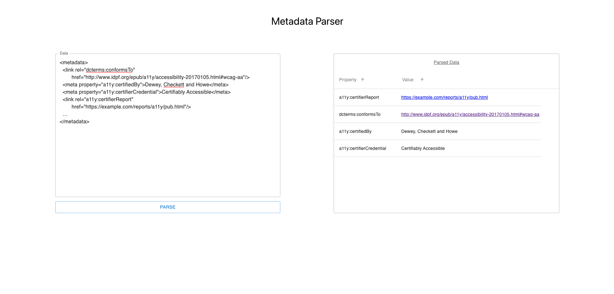

# Metadata Parser
This app allows users to paste in or write pieces of HTML metadata into a textfield and organize the properties of that data in a table.  The table updates in real time so the user can make adjustments to the data and the table will reflect that.  If the user enters information without the correct syntax, a message is displayed to let them know.  The user can click the arrows on the table to organize each column in ascending and descending alphabetical order.  

# Technologies Used

- React
- JavaScript
- CSS
- SASS
- MUI

# Screenshots

# Getting Started

[Click here](https://trmetadataparse.netlify.app/) to see the deployed project

